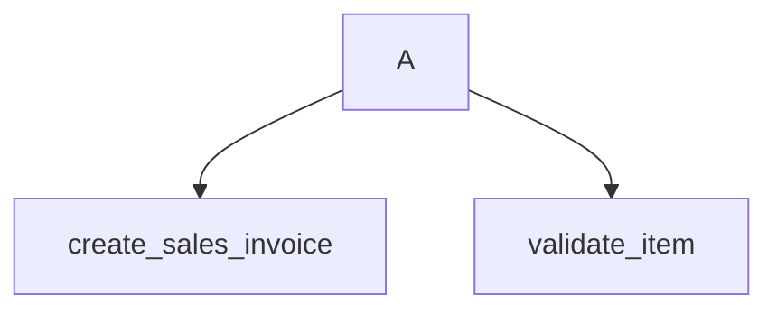

# 🧠 Legacy Code Intelligence & Migration Tool (Offline AI Ready)

A **Python-based static code intelligence and migration framework** that analyzes legacy Python code (such as **ERPNext legacy modules**) using the Python `ast` module, generates **JSON reports**, **Mermaid call graphs**, detects **legacy issues**, recommends **modernization strategies**, and **automatically generates migrated modern code** using **offline AI (LM Studio)** or **rule-based fallback**.

This tool is designed for:

* Legacy ERPNext codebases
* Large Python monoliths
* Migration to modern Python standards
* AI-assisted refactoring (offline-first)

---

## 🚀 Key Features

✔ AST-based static analysis (no code execution)
✔ JSON analysis output
✔ Mermaid call graph generation
✔ Legacy & unsafe pattern detection
✔ Migration recommendations
✔ Offline AI-powered migration (LM Studio)
✔ Rule-based migration fallback (no AI needed)
✔ CLI-first, automation-friendly
✔ Works on **any Python legacy project**

---

## 📂 Project Structure

```
legacy-code-intelligence/
│
├── analyzer/                  # Static analysis layer
│   ├── ast_parser.py          # AST parsing & metrics
│   ├── call_graph.py          # Function call graph builder
│   ├── issues.py              # Legacy issue detection
│   ├── exporter.py            # JSON & Mermaid exporters
│
├── migration/                 # Modernization layer
│   ├── recommender.py         # Migration suggestions
│   ├── ai_migrator.py         # Offline AI migration (LM Studio)
│   ├── rule_migrator.py       # Rule-based migration (fallback)
│
├── cli.py                     # CLI entry point
├── config.py                  # AI & system configuration
├── requirements.txt           # Dependencies
└── README.md                  # Documentation
```

---

## 🔍 How Analysis Works

### 1️⃣ AST Parsing (`analyzer/ast_parser.py`)

Uses Python’s built-in `ast` module to extract:

* Classes
* Functions
* Method counts
* Argument complexity
* Imports

**Why AST?**

* Safe (no execution)
* Accurate
* Language-aware
* Ideal for legacy code analysis

---

### 2️⃣ Call Graph Generation (`analyzer/call_graph.py`)

Extracts function calls and builds relationships.

**Output:**

* Mermaid-compatible graph definition

Example:



This helps visualize:

* Tight coupling
* God functions
* Core utilities

---

### 3️⃣ Legacy Issue Detection (`analyzer/issues.py`)

Detects risky or outdated patterns such as:

* `frappe.db.sql`
* `eval()` / `exec()`
* `print` debugging
* Bare `except:`
* Global variables

These are flagged for migration.

---

### 4️⃣ Exporting Results (`analyzer/exporter.py`)

Generates:

* `analysis.json` → Full machine-readable report
* `callgraph.mmd` → Mermaid diagram

These outputs can be:

* Visualized
* Stored
* Fed into AI pipelines
* Used in CI/CD

---

## 🧭 Migration Recommendation Engine

### (`migration/recommender.py`)

Based on analysis results, the tool suggests:

* Refactoring large functions
* Replacing unsafe APIs
* Introducing type hints
* Using dataclasses
* Applying service/repository patterns

Example output (`recommendations.txt`):

```
Refactor large functions into smaller units
Replace unsafe legacy APIs
Add type hints and dataclasses
Use repository/service pattern
```

---

## 🤖 AI-Based Code Migration (Offline)

### (`migration/ai_migrator.py`)

Uses **LM Studio** (local LLM server) to:

* Rewrite legacy code
* Add type hints
* Introduce dataclasses
* Improve readability
* Remove unsafe constructs

### Supported Models

* DeepSeek Coder
* Code LLaMA
* StarCoder
* Any LM Studio compatible model

📌 **No internet required**

---

## 🧩 Rule-Based Migration (Fallback)

### (`migration/rule_migrator.py`)

If AI is unavailable:

* Converts bare `except:` → `except Exception:`
* Normalizes print statements
* Adds migration headers

Ensures **tool always works**, even in air-gapped environments.

---

## 🖥️ CLI Usage

### Analyze & migrate with AI

```bash
python cli.py path/to/legacy_file.py --ai
```

### Analyze & migrate without AI

```bash
python cli.py path/to/legacy_file.py
```

---

## 📄 Generated Outputs

| File                  | Description                   |
| --------------------- | ----------------------------- |
| `analysis.json`       | AST-based structured analysis |
| `callgraph.mmd`       | Mermaid call graph            |
| `recommendations.txt` | Migration guidance            |
| `migrated_code.py`    | Modernized Python code        |

---

## ⚙️ Configuration

### `config.py`

```python
LM_STUDIO_URL = "http://localhost:1234/v1/chat/completions"
LM_MODEL = "deepseek-coder"
MAX_TOKENS = 4096
```

Ensure LM Studio is running locally before using `--ai`.

---

## 📦 Installation

```bash
pip install -r requirements.txt
```

Python version:

```
Python 3.9+
```

---

## 🏗️ Designed For

* ERPNext legacy modernization
* AI-assisted refactoring tools
* Code intelligence platforms
* Internship / enterprise code audits
* Migration to clean architecture

---

## 🔮 Future Enhancements

Planned extensions:

* Multi-file & project-level analysis
* Java / JavaScript / SQL support
* HTML & PDF reports
* GitHub PR auto-generation
* CI/CD integration
* Code risk scoring
* LLM prompt tuning per framework

---

## 🧠 Philosophy

> “The goal is not just to parse code —
> it’s to **make legacy code understandable, queryable, and migratable**.”

---

## 📜 License

MIT License
Free to use, modify, and extend.
